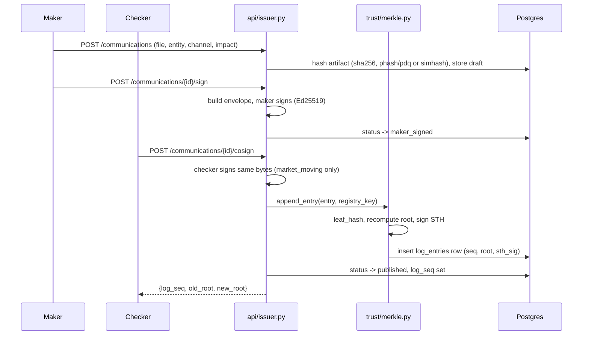
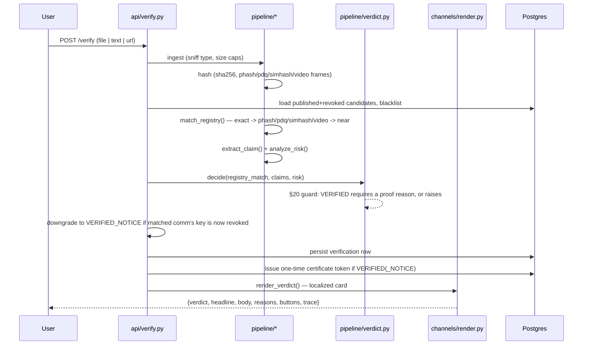

# TrustRail — Architecture

## Component diagram

```mermaid
graph TB
    subgraph Frontend["Next.js 14 (App Router)"]
        Verify["/verify — chat simulator"]
        Issuer["/issuer — maker-checker console"]
        Registry["/registry — entity explorer"]
        Log["/log — transparency log explorer"]
        Supervision["/supervision — SEBI weather map"]
        Cert["/c/[token] — one-time certificate"]
        MerkleTS["lib/merkle.ts — verify_inclusion + verify_sth\n(client-side, no server trust needed)"]
        Log --> MerkleTS
        Cert --> MerkleTS
    end

    subgraph Backend["FastAPI"]
        VerifyAPI["api/verify.py\nPOST /api/verify"]
        IssuerAPI["api/issuer.py\ndraft/sign/cosign/publish/revoke"]
        LogAPI["api/log.py\nroot/entries/proof"]
        RegistryAPI["api/registry.py"]
        TelemetryAPI["api/telemetry.py"]
        TokensAPI["api/tokens.py\nGET /api/c/{token}"]

        subgraph Pipeline["pipeline/"]
            Ingest["ingest.py"]
            Hashing["hashing.py + media.py"]
            Claims["claims.py"]
            Risk["risk.py"]
            EmailCheck["emailcheck.py"]
            Verdict["verdict.py — decide()\n§20 no-VERIFIED-without-proof guardrail"]
        end

        subgraph Trust["trust/"]
            CA["ca.py — Ed25519 keys"]
            Envelope["envelope.py — signature envelope v1"]
            Merkle["merkle.py — RFC 6962 log"]
            Revocation["revocation.py"]
        end

        Render["channels/render.py\nTHE only verdict->copy mapping"]

        VerifyAPI --> Ingest --> Hashing
        VerifyAPI --> Claims
        VerifyAPI --> Risk
        VerifyAPI --> EmailCheck
        VerifyAPI --> Verdict
        Verdict --> Render
        IssuerAPI --> Envelope --> Merkle
        IssuerAPI --> Revocation --> Merkle
        LogAPI --> Merkle
    end

    subgraph Storage
        PG[("PostgreSQL 16")]
        Redis[("Redis 7\nrate limit + root cache")]
        Disk[("var/artifacts/\nvar/trust/")]
    end

    Verify -->|multipart| VerifyAPI
    Issuer -->|X-Demo-Persona| IssuerAPI
    Registry --> RegistryAPI
    Log --> LogAPI
    Supervision -->|polls 10s| TelemetryAPI
    Cert --> TokensAPI

    Backend --> PG
    Backend --> Redis
    Trust --> Disk
```

## Publish sequence

## Verify sequence

## What's mocked vs. real

| Piece | Status | Notes |
|---|---|---|
| Ed25519 signature envelopes | **Real** | PyNaCl, genuinely verified, not stubbed |
| Transparency log | **Real** | RFC 6962 leaf/node hashing, RFC 9162 inclusion-proof verification, mirrored independently in Python and TypeScript |
| Perceptual/content hashing | **Real** | `imagehash.phash`, own SimHash64 implementation, ffmpeg frame extraction |
| Client-side proof verification | **Real** | `frontend/src/lib/merkle.ts` re-derives the root from the leaf + audit path itself — doesn't just trust a server-reported boolean |
| Rule-based claim/risk detection | **Real** | Regex + rapidfuzz + Levenshtein, not a black box |
| PDQ perceptual hash, C2PA embed/read | **Optional, absent by default** | Wrapped in try/except; core path works without either |
| LLM-assisted claim extraction | **Optional, off by default** | `LLM_ENABLED` flag; rule-based path is the required baseline and what's actually exercised in this build |
| WhatsApp channel adapter | **Not built** (Epic 11, explicitly not authorized this round) | `channels/whatsapp.py` + webhook are flag-gated stubs at most |
| SEBI Check integration | **Placeholder URL** | `SEBI_CHECK_URL=#` — button exists, doesn't link anywhere real yet |
| Entities, SEBI reg numbers, all demo content | **Fictional** | No real companies, tickers, or persons anywhere |
| Demo CEO video | **Real footage** | The project owner's own recording — never a synthesized or borrowed likeness (see PROGRESS.md for why this is a hard line, not a preference) |
| Signing keys | **Demo-only** | Private keys persisted in DB/disk for reproducibility — `TODO(prod): HSM` comments mark every spot |

## Production path (out of scope for this prototype's code)

What a real, regulator-grade version of this would need beyond a hackathon
prototype:

- **TrustMark / invisible watermarking** — an embedded, robust watermark
  survives transformations that break perceptual hashing (heavy crops,
  screenshots-of-screenshots, format conversion chains) in ways phash/PDQ
  alone can't.
- **TMK+PDQF** — Meta's video-hashing scheme (temporal keyframes + PDQ per
  frame) is the production-grade version of this prototype's
  1fps-phash-list approach; better resilience to reframing and speed
  changes.
- **Real NSE/BSE/exchange ingestion** — this prototype's registry is
  seeded fixtures; production would ingest actual corporate announcements
  and filings directly from exchange feeds, not a manual issuer console.
- **DLT/permissioned-ledger backing for the transparency log** — the
  current log is a single Postgres-backed Merkle tree with one registry
  signing key; a regulator-grade deployment would distribute trust across
  multiple signing parties (exchanges, depositories, SEBI itself) rather
  than one root of trust.
- **WhatsApp Business "green tick" / verified sender badge** — integrating
  with Meta's official business verification program rather than TrustRail
  issuing its own visual language for verified content.
- **HSM-backed key custody** — every private key in this build lives in
  Postgres/disk for demo reproducibility; production signing keys belong
  in hardware security modules with proper key-ceremony procedures, never
  in an application database.
- **OCR for image/video text** — claim extraction here is caption/body
  text only; a production system would OCR visible text inside images and
  video frames to catch claims embedded in the pixels themselves.
